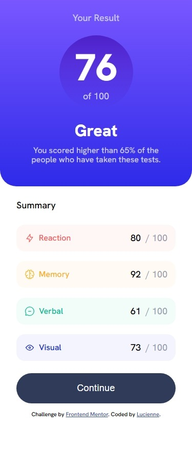
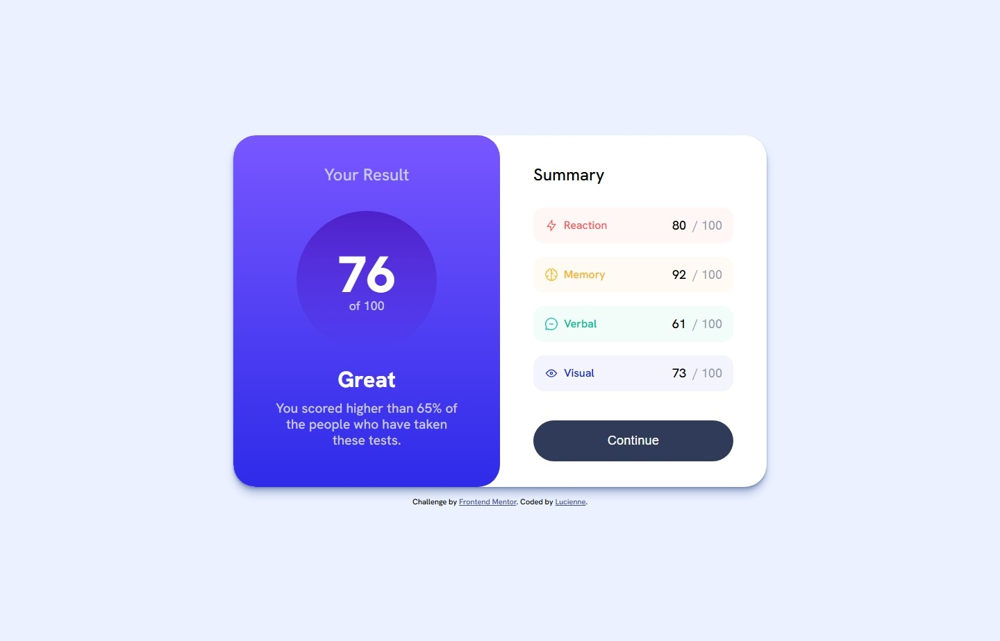

# Frontend Mentor - Results summary component solution

This is a solution to the [Results summary component challenge on Frontend Mentor](https://www.frontendmentor.io/challenges/results-summary-component-CE_K6s0maV). Frontend Mentor challenges help you improve your coding skills by building realistic projects. 

## Table of contents

- [Overview](#overview)
  - [The challenge](#the-challenge)
  - [Screenshot](#screenshot)
- [My process](#my-process)
  - [Built with](#built-with)
  - [What I learned](#what-i-learned)
  - [Continued development](#continued-development)
  - [Useful resources](#useful-resources)
- [Author](#author)

## Overview

### The challenge

Users should be able to:

- View the optimal layout for the interface depending on their device's screen size
- See hover and focus states for all interactive elements on the page
- **Bonus**: Use the local JSON data to dynamically populate the content

### Screenshot
#### Mobile Screenshot:

#### Desktop Sreenshot:


## My process

### Built with
- Semantic HTML5 markup
- CSS custom properties
- Flexbox
- CSS Grid
- Mobile-first workflow

### What I learned
1. practice CSS Nesting and using :nth-child selector
```css
.score-card__item {
    ...
    &:nth-child(1) {
        background-color: var(--color-light-red-005);
        & .score-card__label {
            color: var(--color-light-red);
        }
    }
    ...
}
```
2. clamp
```css
main {
    width: clamp(0px,100%, 768px);
}
```
My understanding is that it equals
```css
main {
    width: 100%;
    min-width: 0px;
    max-width: 768px;
}
```

### Continued development

Use this section to outline areas that you want to continue focusing on in future projects. These could be concepts you're still not completely comfortable with or techniques you found useful that you want to refine and perfect.

I want to focus more on using `clamp()`, `grid` and `flex` in the future.


### Useful resources

- [Perfect Pixel](https://chromewebstore.google.com/detail/perfectpixel-by-welldonec/dkaagdgjmgdmbnecmcefdhjekcoceebi) - This helped me for design accuracy.
- [Shadow Palette Generator](https://www.joshwcomeau.com/shadow-palette/) - This helped me for generating shadow.

## Author
- Frontend Mentor - [Lucienne](https://www.frontendmentor.io/profile/LucienneHuang)

